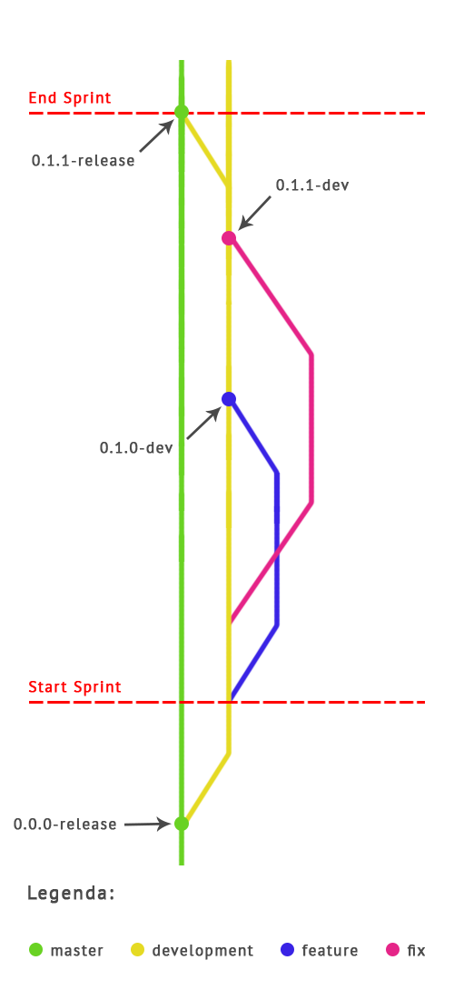

[Home](/README.md) | [Iniciativa](#iniciativa) | [A Equipe](#a-equipe)| [Plano de Desenvolvimento](#plano-de-desenvolvimento) | [Entregas](/docs/iteracoes.md) | [Mockups](/docs/mockups.md) | [Scrum Planning](https://docs.google.com/spreadsheets/d/1IM-rr2NfbDLIVCjXCaKXF7hhWi1qT7XSH_i9--tT9F8/) |
|----|----|----|----|----|----|----|

# AppLada

O AppLada é uma plataforma online para organizar jogos de futebol, a **_pelada_**, e encontrar jogos organizados por outros jogadores, que estejam acontecendo próximos de você.

## Iniciativa

A ideia de desenvolvimento da plataforma surgiu da tentativa de sanar a dor de um dos membros da nossa equipe, Lucas Burgos. Ele em seu tempo livre, às vezes tem a vontade de jogar uma pelada, porém não conhece pessoas que estejam interessadas em jogar, ou pessoas com disponibilidade para jogar naquele momento, ele não se importaria de jogar com pessoas que não conhece.

Sabemos que há mais pessoas como Lucas que gostariam de encontrar pessoas para jogar, não só futebol mas também outros esportes como vôlei e basquete. Portanto seria ideal ter uma plataforma que conectasse pessoas interessadas em jogar uma partida.

Além dessas pessoas, outras ideias foram surgindo em cima desse problema. Como por exemplo, mapeamento de **Societys** para organização de eventos como torneios. A Solução traria benefícios para jogadores e donos de Societys.

## A Equipe

A nossa equipe é formada por 6 alunos do curso de Sistemas de Informação do CIn UFPE:

* Igor Fernandes (ifc@cin.ufpe.br)
* Kayque Santos (klss@cin.ufpe.br)
* Lucas Burgos (lpcb@cin.ufpe.br)
* Marcos Galvão (matg@cin.ufpe.br)
* Sheldon Fekete (jsbf@cin.ufpe.br)
* Talyta Pacheco (tmrp@cin.ufpe.br)

## Plano de Desenvolvimento

Para desenvolver todo o sistema por trás dessa plataforma. Nossa equipe irá mesclar duas metodologias ágeis: **Extreme Programming (Test-first)** e **SCRUM (Sprints)**.

### Processo de Desenvolvimento

Ao ínicio do projeto será definido as funcionalidades que estarão presentes no **MVP**. Elas serão colocadas no **ProductLog** para serem usadas no **BackLog** das sprints. Ideias que surgirem durante a execução do projeto serão adicionadas ao ProductLog, porém categorizadas como baixa prioridade, servindo somente de tarefa de uma sprint caso o MVP esteja completo.

**As sprints terão duração de uma semana**, e terão seu ínicio nas **quintas-feiras**, dessa forma todo o conteúdo aprendido durante as aulas de Engenharia de Software da semana poderão ser usado como base para o planejamento da próxima da sprint.

Reuniões da equipe (**Sprint Meeting**) ocorrerão nas **segundas-feiras**, **quarta-feiras** e **sábados** Os tópicos das reuniões são:

* **Segunda-feira**: Status Report das tarefas de cada membro da equipe
* **Quarta-feira:** Retrospectiva da Sprint anterior e definição da tarefas das próxima sprint.
* **Sábado:** Status Report das tarefas de cada membro da equipe

### Divisão do Trabalho

A equipe será dividida em dois times, o time responsável pelo WebApp e outro responsável pelo API de integração. Porém, entre as sprints se for percebido a necessidade de realocação de pessoas para a conclusão das tarefas da próxima sprint, a realocação será feita.

#### Time WebApp
* Kayque Santos (klss@cin.ufpe.br)
* Lucas Burgos (lpcb@cin.ufpe.br)
* Talyta Pacheco (tmrp@cin.ufpe.br)

#### Time API
* Igor Fernandes (ifc@cin.ufpe.br)
* Marcos Galvão (matg@cin.ufpe.br)
* Sheldon Fekete (jsbf@cin.ufpe.br)

### Controle de Versionamento

#### Branches

**master:** Versão estável, versão em execução no servidor em nuvem (Produção). Antes dos merge nessa branch teste completos (de integração entre features) deverão ser executados.

**development:** Código-fonte de desenvolvimento, novas features devem ser ramificadas dessa branch. Antes dos merge nessa branch testes unitários deverão ser executados.

**feature:** Novas funcionalidades que estão sendo desenvolvidas recebem uma branch própria para desenvolvimento. Padrão de nome: **_feature-##-summary_**. **##** para o número referente a issue relacionada, e **summary** uma breve descrição da funcionalidade.

**fix:** Consertos de bugs são feitos uma branch separada e incorporada em _development_ quando conluídas. Padrão de nome: **_fix-##-summary_**. Utilizando a mesma regra da branch _feature_.

#### Tags

Sempre que um merge entre as branch citadas for realizada uma nova tag será criada para demarcar uma nova versão. A regra do número da versão é: **core.feature.fix**.
* **Core** é acrescido em 1 caso uma refatoração completa seja realizada, os demais números são zerados.
* **Feature** é acrescido em 1 sempre que uma nova funcionalidade for adicionada a plataforma, o número do fix é zerado nesse caso.
* **Fix** é acrescido em 1 sempre que um bug for corrigido.

Promoções de versões (código de desenvolvimento tornar-se de produção) ocorrerá no fim das sprints. A última versão de desenvolvimento será testada por completo e somente liberada caso passe no teste. Caso contrário, o _fix_ deverá ser realizado durante a próxima sprint, e a promoção de versão é colocada como uma das tarefas da sprint a ser realizado após o _fix_.
